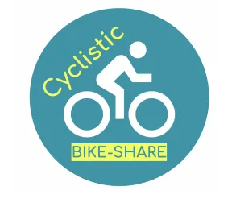
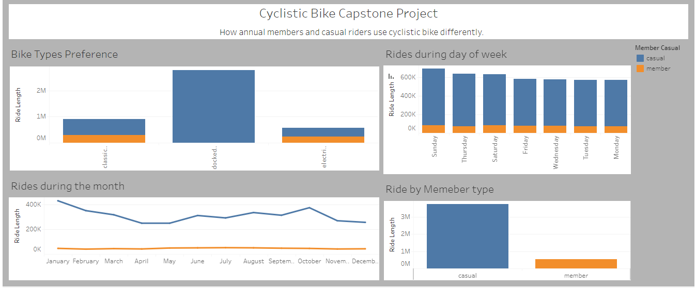

# Cyclistic-Bike-Share-Capstone-Project

## Introduction
This is my Coursera Google Data Analytics Capstone Project. The project is to analyze and derive insight to answer an important question and help Cyclistic bike_share company at Chicago to make driven decision.

## Problem statement
How do annual members and casual riders use cyclistic bikes differently.

## Skill Demonstrated
1.	Vertical merging of dataset using R
2.	Data wrangling using Excel and R

## Data Sourcing
The data used was made available by Motivate International Inc. Twelve (12) months of the Cyclistic trip data of 2022 was downloaded. It is in a CSV format.  

## Data Transformation/Cleaning:
Data was cleaned and transformed with R programming. Some of the steps includes:
1.	Created new columns ride_length [to calculate the length of each ride], day_of_week [to calculate the day of the week that each ride start] data, month, year.
2.	Checked consistency with header columns before merging dataset.
3.	Checked and removed Null values from the dataset.
4.	Changed Datatype from ‘CHAR’ TO ‘NUMERIC’.
5.	Convert time to align with R datetime format.

## Data Analysis and Visual

1.	From the dashboard, it is observed that there are more causal riders compared to annual members.
2.	Docked bikes are only used by causal riders.
3.	Sunday has the highest ride in the weekdays with causal riders having higher rides.
4.	The month of January has the highest ride rate for causal riders and annual members having lower ride rate across the month.

## Conclusion/Recommendation

The causal riders dominated annual members largely in the month, day of week, bike preference and member types analysis.
Annual members have no usage of docked bikes.
The month of October has a spike of causal rides after January.

Recommendation: cyclistic should pay attention on why docked bikes are only used by causal riders.
They analysis on ground may suggest to convert the causal riders to annual members but further findings should be done to check the age bracket, job location and home address of the cyclistic biker users.

